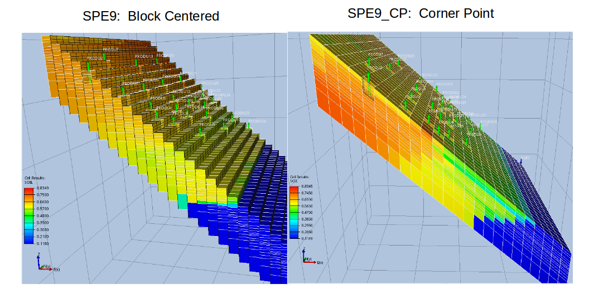

```{r setup, include=FALSE}
require(knitr)
knitr::opts_knit$set(root.dir = "~/gitrepos/spe9hm/")
knitr::opts_chunk$set(echo = TRUE, cache=TRUE)
```

## Examining the SPE9 Models
This work is done in [R](https://www.r-project.org/), and is helped along using an R package that is under development to work with the OPM modeling tools, [runOPM](https://github.com/gerwathome/runOPM).

First we need to get the SPE9 deck from the OPM repository.  There are two SPE9 decks, one with a block centered description , and one with a corner point description.  We will try both the cartesian and corner point decks, to try to understand the differences.  These decks will be put into a "test" project.

```{r getdata, eval=TRUE}
library(runOPM)
ok <- makeproj(basedir="test")
if(!ok){warning("There seems to have been a problem in making the project directory structure")}
baseurl <- "https://raw.githubusercontent.com/OPM/opm-data/master/spe9/"
infiles <- c("SPE9.DATA", "PERMVALUES.DATA", "TOPSVALUES.DATA", "SPE9_CP.DATA",
             "SPE9.GRDECL")
for(fn in infiles){
  urlin <- paste0(baseurl,fn)
  fnout <- paste0("test/DECKS/",fn)
  download.file(url = urlin, destfile = fnout, method='curl')
}
deckpath <- file.path("test","DECKS")
pat <- ".+\\.(data|DATA)"
decks <- list.files(path = deckpath,
                    pattern = pat,
                    full.names = TRUE,
                    recursive = TRUE,
                    include.dirs = TRUE)
decks
```

Some of these files look more like include files, and should be in lower level directories.  Let's search for INCLUDE in the files to see which files are which.

```{r checkincludes, eval=TRUE}
for(deck in decks){
  deckname <- basename(deck)
  dk <- readLines(deck, warn = FALSE)
  lnum <- grep(pattern = "^INCLUDE$", x = dk, perl = TRUE)
  if(length(lnum) > 0){
    for(i in 1:length(lnum)){
      print(paste0("deck:", deckname, ", line:  ", lnum[i]+1, ", text:  ",
                   dk[lnum[i]+1]))
    }
  }
}
```
It looks like three include files in two main decks.  We will move the include files down a directory, change the extents so they won't be confused with decks anymore, and change the include file names in the main decks.  We will put the "includes" in a GRID subdirectory.

```{r fix_includes, eval=TRUE}
gridpath <- file.path(deckpath,"GRID")
if(!dir.exists(gridpath)){dir.create(gridpath)}
incfiles <- c("SPE9.GRDECL", "PERMVALUES.DATA", "TOPSVALUES.DATA")
tofiles <- gsub("DATA", "INC", incfiles)
deckfiles <- c("SPE9_CP.DATA", "SPE9.DATA")
for(fn in deckfiles){
  f <- readLines(file.path(deckpath, fn))
  for(i in 1:length(incfiles)){
    fromfn <-  file.path(deckpath, incfiles[i])
    tofn <- file.path(gridpath,tofiles[i])
    if(identical(fn,deckfiles[1])){file.rename(fromfn, tofn)}
    rptofn <- file.path("GRID",tofiles[i])
    if(any(grep("INC",rptofn))){rptofn <- paste0("'",rptofn,"'")}
    f <- gsub(incfiles[i], rptofn, f, fixed = TRUE)
  }
  writeLines(f, con = file.path(deckpath, fn))
}
```
The SPE9.DATA deck needs some edits to be a little more consistent with SPE9_CP.DATA, which appears to give the results expected by the original SPE9 paper.  Thes are mostly output changes.
```{r edit SPE9.DATA}
fn <- "SPE9.DATA"
fnp <- file.path(deckpath, fn)
f <- readLines(fnp)
# add OLDTRAN, even though it is pointless
props_line <- grep("PROPS",f,fixed = TRUE)
before <- props_line - 1
f <- c(f[1:before], "OLDTRAN", f[props_line:length(f)])
# uncomment some keywords for reporting
kws <- c("WGIT", "WGPT", "WOPT", "WWIT", "WWPT")
for(kw in kws){
  pat <- paste0("--",kw)
  kwline <- grep(pat, f, fixed=TRUE)
  f[kwline] <- kw
  f[kwline + 1] <- "/"
}
# print out the graphic data comparably with SPE9_CP
f <- gsub("BASIC=4","BASIC=2", f )
writeLines(f, con=fnp)
```

Next we run the SPE9 decks to see how they work with ***flow***.
```{r cartesian_or_cornerpoint, out.width='45%', out.height='45%'}
for(deck in deckfiles){
 ok <- runflow(deck, basedir = "test", wait=TRUE)
 if(ok > 0){print(ok)}
}
results <- eclsum(basedir="test")
ploteach(results, wgnames="FIELD")
```

Both SPE9 decks run, but give significantly different answers.  Trying to find an explanation online, I found this github thread: [SPE9.DATA #81](https://github.com/OPM/opm-data/issues/81).  It says (if I understand it correctly) that the SPE9_CP deck, with explicitly defined corner point connections, provides the correct answer.  The block-centered version of the deck doesn't do what one would expect because ***flow*** does not implement the Eclipse keyword `OLDTRAN`.  The old method of transmissibility calculation was the classic cartesian approach that assumed only lateral connectivity in *ijk* space, not *xyz* space.  Becuase ***flow*** uses the new transmissibility calculation method, an old style 'sugar cube' model will communicate with multiple cubes laterally when the cell dimensions and elevations imply overlapping cells in *xyz* space.

In the oil saturation comparison plots below, note in particular the thin layers near the top of the model directly updip of the oil-water contact.  The corner point model captures the expected stratigraphic continuity.  Lower water production in the block centered model, as shown in the plot above, is consistent with lower stratigraphic continuity.  The lack of an easy path updip, and the increased lateral continiuty in *xy* space keeps the water much lower in the model, and leads to the observed lower water production.

Because ***flow*** does not implement `OLDTRAN`, the block centered model fails to capture the expected lateral connectivity.  This caveat for using ***flow*** was not apparent to me until I examined these two models.  It appears that even though the block centered keywords are supported, they should not be used without great caution, as they will not act as expected.  It would be nice to see an open source tool which would convert a simple block centered grid to a corner point grid.  More complex grids with faults and pinchouts are better handled with corner point geometry, but simple models work very well with block centered geometry, and are much simpler to construct.



## Porosity - Permeability relationships

We will pull out the porosity and permeability, so we can make some rock regions.  The intent is to do some kmeans clustering to define rock groups, and then create regions in the deck suitable for history matching.

```{r poro_perm}
fn <- file.path(deckpath,"SPE9_CP.DATA")
poro_perm <- readDeck(deckname = fn, props = c("PORO","PERMX"))
head(poro_perm)
write.csv(poro_perm, file = "poroperm.csv")
library(ggplot2)
ggp <- ggplot(poro_perm, aes(x=PORO, y=PERMX))
ggp <- ggp + scale_y_log10()
ggp <- ggp + geom_point()
ggp

ggp <- ggplot(poro_perm, aes(x=PERMX, fill=as.factor(K)))
ggp <- ggp + scale_x_log10()
ggp <- ggp + geom_density(alpha=0.5)
ggp

ggp <- ggplot(poro_perm, aes(x=PERMX, fill=as.factor(PORO)))
ggp <- ggp + scale_x_log10()
ggp <- ggp + geom_density()
ggp <- ggp + coord_fixed()
ggp <- ggp + facet_grid(as.factor(K) ~ .)
ggp

ggp <- ggplot(poro_perm, aes(x=PERMX, fill=as.factor(K)))
ggp <- ggp + scale_x_log10()
ggp <- ggp + geom_density(alpha=0.5)
ggp <- ggp + coord_fixed()
ggp <- ggp + facet_grid(as.factor(PORO) ~ .)
ggp

ggp <- ggplot(poro_perm, aes(x=as.factor(K), y=PERMX,
                             fill=as.factor(PORO)))
ggp <- ggp + scale_y_log10()
ggp <- ggp + geom_boxplot()
ggp
```

## Create a History Match Deck
There is no obvious porosity/permeability/layer relationship that would allow one to make rational rock type groupings.  The data appear to be a little too artificial  For the purposes of creating a synthetic history match example, we will use permeability multipliers for each of the 15 layers.
```{r layer_mults, eval=TRUE}
dbg <- TRUE
ddbg <- FALSE
set.seed(7734)
mults <- runif(n=15, min=0.5, max=1.5)
answer_mults <- 1 / mults
ok <- makeproj(basedir="sim")
if(!ok){warning("There seems to have been a problem in making the project directory structure")}
frompath <- file.path("test", "DECKS")
topath <- file.path("sim", "DECKS")
fromdeck <- file.path(frompath, "SPE9_CP.DATA")
histdeck <- file.path(topath, "HISTORY.DATA")
basedeck <- file.path(topath, "BASE.DATA")
ok <- file.copy(fromdeck, histdeck, overwrite = TRUE)
if(!ok){
  warning(paste("Failed to copy",
                fromdeck,
                "to",
                histdeck))
}
ok <- file.copy(fromdeck, basedeck, overwrite = TRUE)
if(!ok){
  warning(paste("Failed to copy",
                fromdeck,
                "to",
                basedeck))
}
fromgrid <- file.path(frompath,"GRID")
togrid <- file.path(topath,"GRID")
if(!dir.exists(togrid)){
  ok <- dir.create(togrid)
  if(!ok){
    warning(paste("Failed to create directory",
                  togrid))
  }
}
incs <- c("SPE9.GRDECL", "PERMVALUES.INC")
for(i in 1:length(incs)){
  ok <- file.copy(file.path(fromgrid,incs[i]),
            file.path(togrid,incs[i]),
            overwrite = TRUE)
  if(!ok){
  warning(paste("Failed to copy",
                file.path(fromgrid,incs[i]),
                "to",
                file.path(togrid,incs[i])))
}
}
permedit <- list()
permedit <- c(permedit, "MULTIPLY")
for(i in 1:length(mults)){
  permedit <- c(permedit,
                paste("    'PERMX'", mults[i], 1, 24, 1, 25, i, i, "/"))
}
permedit <- c(permedit, "/")
permedit <- c(permedit, "ENDBOX")
permedit <- c(permedit, "COPY")
permedit <- c(permedit,  "	  PERMX PERMY  /")
permedit <- c(permedit,  "	  PERMX PERMZ  /")
permedit <- c(permedit,  "/")
permedit <- c(permedit,  "MULTIPLY")
permedit <- c(permedit,  "	  PERMZ 0.01 /")
permedit <- c(permedit,  "/")
permedit <- unlist(permedit)
bd <- readLines(basedeck)
inpoint <- grep("PERMVALUES", bd) + 1
bd <- c(bd[1:inpoint], permedit, bd[(inpoint+1):length(bd)])
writeLines(bd, con=basedeck)
```

## Run the Cases

```{r runsim, eval=TRUE, out.width='45%', out.height='45%'}
indecks <- list.files(path=topath, pattern="^\\w+\\.(DATA|data)$")
for(i in 1:length(indecks)){
  ok <- runflow(indecks[i], basedir="sim", wait=TRUE)
  if(ok > 0){print(ok)}
}
simrslts <- eclsum(basedir="sim")
#ploteach(simrslts)
ploteach(simrslts, wgnames="FIELD")
```

## Create a Template Deck.

```{r create_template}
spe9templ <- file.path(topath, "SPE9.TEMPLATE")
ok <- file.copy(fromdeck, spe9templ, overwrite = TRUE)
if(!ok){
  warning(paste("Failed to copy",
                fromdeck,
                "to",
                spe9templ))
}
permedit <- list()
permedit <- c(permedit, "MULTIPLY")
for(i in 1:length(mults)){
  permedit <- c(permedit,
                paste("    'PERMX'", paste0("{$PERMX_",i,"}"),
                      1, 24, 1, 25, i, i, "/"))
}
permedit <- c(permedit, "/")
permedit <- c(permedit, "ENDBOX")
permedit <- c(permedit, "COPY")
permedit <- c(permedit,  "	  PERMX PERMY  /")
permedit <- c(permedit,  "	  PERMX PERMZ  /")
permedit <- c(permedit,  "/")
permedit <- c(permedit,  "MULTIPLY")
permedit <- c(permedit,  "	  PERMZ 0.01 /")
permedit <- c(permedit,  "/")
permedit <- unlist(permedit)
td <- readLines(spe9templ)
inpoint <- grep("PERMVALUES", td) + 1
td <- c(td[1:inpoint], permedit, td[(inpoint+1):length(td)])
writeLines(td, con=spe9templ)
```

